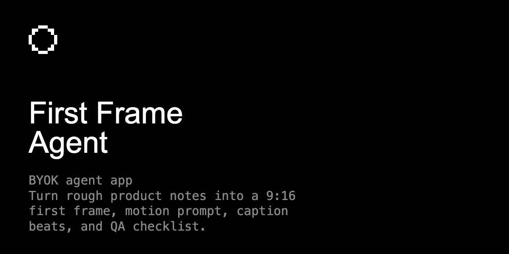

# First Frame Agent

[](https://github.com/dvnc-labs/first-frame-agent/actions/workflows/ci.yml) [](LICENSE) [](https://github.com/dvnc-labs/first-frame-agent/releases)

Turn rough product notes into a 9:16 first frame, motion prompt, caption beats, and QA checklist.



## Features

- Converts a messy product, service, or creator note into one decisive vertical first-frame direction.
- Packages the output as an opening frame recipe, image prompt, motion prompt, caption beats, negative prompt, and QA checklist.
- Uses the visitor's selected provider key per request, with OpenAI models able to render the frame through the hosted image generation tool.

## Quick Start

### Clone the app

```bash
git clone https://github.com/dvnc-labs/first-frame-agent && cd first-frame-agent
```

### Run locally

```bash
bun install
bun run dev
```

### Use your key

```bash
open http://localhost:3000
# Paste your own OpenAI, Anthropic, or Google AI key in the app
```

## Architecture

```text
+-------------------------------+
| BYOK agent app                |
+---------------+---------------+
                |
                v
+-------------------------------+
| First Frame Agent             |
+---------------+---------------+
                |
                v
+-------------------------------+
| User-owned runtime / config   |
+-------------------------------+
```

1. Next.js renders a one-page frame-building workflow with provider selection and a BYOK key gate.
2. The browser keeps the visitor key in session storage and sends it only to the same-origin /api/run route as x-provider-key.
3. The route builds the selected provider client from that request key, streams the director board, and exposes image generation only when the selected OpenAI model supports it.
4. No author-owned inference key is stored, logged, proxied as fallback, or required for runtime use.

## Configuration

- No server API key is required for local use.
- Visitors bring their own OpenAI, Anthropic, or Google AI key.
- OpenAI image-capable models can render the first-frame concept image; text-only providers return the structured slate.

## Development

```bash
bun install
bun run lint
bun run typecheck
bun run build
PORT=3219 bun run test
```

## Built With

- Next.js 16
- React 19
- AI SDK BYOK transport
- OpenAI Responses image generation tool
- shadcn-compatible Base UI primitives
- Omid Saffari Labs ai-app-starter

## Contributing

Read [CONTRIBUTING.md](CONTRIBUTING.md) before opening an issue or pull request. This project follows the [Code of Conduct](CODE_OF_CONDUCT.md).

## Distribution

- Launch as a public dvnc-labs BYOK demo after GitHub Actions passes.
- Share with image-to-video, UGC, product marketing, and creator workflow communities.
- Use the generated assets/og.png as the GitHub social preview.

## License

MIT - see [LICENSE](LICENSE). Built by [Omid Saffari](https://github.com/omidsaffari).
